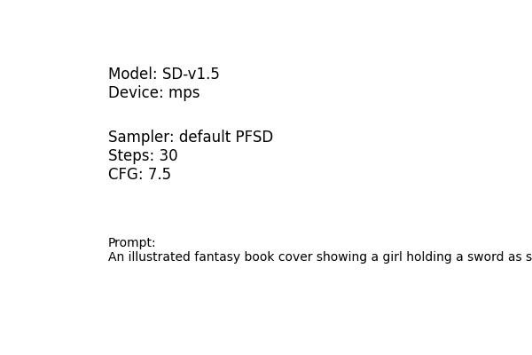

# 🎵 AI-Generated Vinyl Album Cover

*Generated on 2025-08-05 00:06:20*

## 💼 Original Cover


---

## 🎨 AI-Generated Variation


---

## ⚙️ Technical Details

| Parameter | Value |
|-----------|-------|
| **Model** | runwayml/stable-diffusion-v1-5 |
| **Device** | mps (Apple Silicon) |
| **Memory** | Shared system memory |
| **Inference Steps** | 30 |
| **Guidance Scale** | 7.5 |
| **Generation Time** | 795.82 seconds |
| **Torch dtype** | float32 |

## 📝 Prompt Used

```
A fantasy album cover illustration of a girl with a sword stepping into a glowing blue door, magical forest, glowing elements, mystical atmosphere, fireflies, misty background, mysterious and hopeful atmosphere, cinematic lighting, soft ethereal glow, highly detailed, fantasy art style
```

## 📸 Pipeline Configuration



## 🧰 Resources & Tools

- **Framework**: Hugging Face Diffusers
- **Interface**: Custom Python pipeline (self-hosted)
- **Hardware**: Apple Silicon with Shared system memory
- **Model Source**: Hugging Face Model Hub

## 📁 Output Files

- `main_cover.jpg` - Original cover copy
- `generated_album_cover.jpg` - AI-generated variation
- `pipeline_screenshot.jpg` - Configuration summary
- `report.md` - This report

---

*Generated using Stable Diffusion pipeline*
